# HealthAccess AI - System Design Document

## Executive Summary

HealthAccess AI is a low-bandwidth, multilingual, voice-first healthcare access assistant designed to bridge the gap between complex medical information and underserved communities. The system simplifies medical reports, matches users with government healthcare schemes, and provides audio-based guidance for low-literacy users in rural and semi-urban areas.

---

## System Architecture

### High-Level Architecture

```
┌──────────────────────────────────────────────────────────────────────────────┐
│                          USER INTERFACE LAYER                                 │
├──────────────────────────────────────────────────────────────────────────────┤
│                                                                              │
│   • Mobile Application (Android / iOS)                                       │
│   • Web Application                                                          │
│   • Language Selection (Telugu, Hindi, etc.)                                 │
│   • Report Upload / Scan Interface                                           │
│                                                                              │
└───────────────────────────────────────┬──────────────────────────────────────┘
                                        │
                                        ▼
┌──────────────────────────────────────────────────────────────────────────────┐
│                            API GATEWAY LAYER                                  │
├──────────────────────────────────────────────────────────────────────────────┤
│                                                                              │
│   • Authentication & Authorization                                           │
│   • Rate Limiting & Throttling                                                │
│   • Request Routing                                                          │
│   • Load Balancing                                                           │
│   • Caching & Compression                                                    │
│                                                                              │
└───────────────────────────────────────┬──────────────────────────────────────┘
                                        │
                                        ▼
┌──────────────────────────────────────────────────────────────────────────────┐
│                        DOCUMENT PROCESSING LAYER                               │
├──────────────────────────────────────────────────────────────────────────────┤
│                                                                              │
│   ┌──────────────┐   ┌──────────────┐   ┌──────────────┐                    │
│   │ Image / PDF  │ → │ OCR Engine   │ → │ Text         │                    │
│   │ Upload       │   │ (Textract /  │   │ Extraction  │                    │
│   │ Handler      │   │  Tesseract)  │   │              │                    │
│   └──────────────┘   └──────────────┘   └──────────────┘                    │
│                                                                              │
└───────────────────────────────────────┬──────────────────────────────────────┘
                                        │
                                        ▼
┌──────────────────────────────────────────────────────────────────────────────┐
│                           AI PROCESSING LAYER                                  │
├──────────────────────────────────────────────────────────────────────────────┤
│                                                                              │
│   1. Document Understanding                                                  │
│   ┌───────────────────────────────────────────────────────────────┐          │
│   │ • Report Type Classification                                  │          │
│   │ • Key-Value Extraction (Hb, BP, Sugar, etc.)                  │          │
│   │ • Medical Named Entity Recognition (NER)                      │          │
│   └───────────────────────────────────────────────────────────────┘          │
│                                                                              │
│   2. LLM Reasoning Engine                                                     │
│   ┌───────────────────────────────────────────────────────────────┐          │
│   │ • Medical jargon simplification                                │          │
│   │ • Context-aware explanation                                   │          │
│   │ • Personalized health guidance                                │          │
│   │   (AWS Bedrock / Claude / LLaMA)                               │          │
│   └───────────────────────────────────────────────────────────────┘          │
│                                                                              │
│   3. Retrieval-Augmented Generation (RAG)                                    │
│   ┌───────────────────────────────────────────────────────────────┐          │
│   │ • Medical Knowledge Base Retrieval                             │          │
│   │ • Government Scheme Matching                                   │          │
│   │ • Vector Search (Embeddings)                                   │          │
│   └───────────────────────────────────────────────────────────────┘          │
│                                                                              │
└───────────────────────────────────────┬──────────────────────────────────────┘
                                        │
                                        ▼
┌──────────────────────────────────────────────────────────────────────────────┐
│                        OUTPUT GENERATION LAYER                                 │
├──────────────────────────────────────────────────────────────────────────────┤
│                                                                              │
│   • Structured Health Summary (Text)                                         │
│   • Multilingual Translation                                                  │
│     (Telugu, Hindi, Tamil, Kannada, Bengali, etc.)                           │
│                                                                              │
│   • Text-to-Speech Conversion (AWS Polly)                                    │
│   • Audio Formatting & Compression                                           │
│                                                                              │
│   • SMS / Notification Action Plan                                           │
│                                                                              │
└───────────────────────────────────────┬──────────────────────────────────────┘
                                        │
                                        ▼
┌──────────────────────────────────────────────────────────────────────────────┐
│                          DATA & STORAGE LAYER                                  │
├──────────────────────────────────────────────────────────────────────────────┤
│                                                                              │
│   • Medical Knowledge Base                                                   │
│   • Government Scheme Database                                               │
│   • User Profile Database                                                    │
│                                                                              │
│   • Document Storage (AWS S3)                                                 │
│   • Audio Cache (Redis)                                                      │
│   • Analytics, Logs & Monitoring                                             │
│                                                                              │
└──────────────────────────────────────────────────────────────────────────────┘
```

### Data Flow

```
User Upload → OCR → Document Classification → 
Knowledge Retrieval → LLM Reasoning → Simplification → 
Translation → TTS → Compressed Audio → User
```

### Technology Stack

| Layer | Technologies |
|-------|-------------|
| **OCR** | AWS Textract / Google Cloud Vision / Tesseract |
| **LLM** | AWS Bedrock (Claude) / Llama 3 / GPT-4 |
| **TTS** | AWS Polly / Google Cloud TTS |
| **Backend** | FastAPI / Flask (Python), AWS Lambda |
| **Storage** | AWS S3, PostgreSQL, FAISS / Pinecone |
| **Frontend** | React / Next.js (PWA) |
| **Infrastructure** | AWS / Google Cloud, CloudFront |

---

## User Flow Diagram

### HealthAccess AI - Dark Mode Architecture

```mermaid
%%{
  init: {
    "theme": "dark",
    "themeVariables": {
      "darkMode": true,
      "background": "#111111",
      "primaryColor": "#2196F3",
      "secondaryColor": "#FF9800",
      "tertiaryColor": "#9C27B0",
      "lineColor": "#FFFFFF",
      "mainBkg": "#1a1a2e",
      "nodeBkg": "#1a1a2e",
      "clusterBkg": "#0a0a0a",
      "clusterBorder": "#2196F3"
    },
    "flowchart": {
      "curve": "basis",
      "padding": 50,
      "nodeSpacing": 100,
      "rankSpacing": 150,
      "diagramPadding": 20
    }
  }
}%%

flowchart TD
    %% Node Styling Definitions
    classDef homeNode fill:#1a3a5c,stroke:#2196F3,stroke-width:3px,color:#ffffff,font-size:16px,padding:15px
    classDef processNode fill:#3d2914,stroke:#FF9800,stroke-width:3px,color:#ffffff,font-size:16px,padding:15px
    classDef resultNode fill:#1a2e3a,stroke:#9C27B0,stroke-width:3px,color:#ffffff,font-size:16px,padding:15px
    
    %% Screen 1: Home (Input Stage) - Dark Blue
    subgraph HOME[" 🏠 HOME - INPUT STAGE "]
        direction TB
        A1["📱 Smartphone / User"]:::homeNode
        A2["User Selects Language<br/>(Telugu)"]:::homeNode
        A3["🖱️ Clicks 'Scan Report' Button"]:::homeNode
        
        A1 --> A2
        A2 --> A3
    end
    
    %% Screen 2: Processing (Analysis Stage) - Gold/Orange
    subgraph PROCESS[" ⚙️ PROCESSING - ANALYSIS STAGE "]
        direction TB
        B1["📄 Document Scanning"]:::processNode
        B2["🔍 Analyzing Medical Text..."]:::processNode
        B3["🏛️ Checking Govt Schemes..."]:::processNode
        
        B1 --> B2
        B2 --> B3
    end
    
    %% Screen 3: Result Dashboard (Output Stage) - Green/Purple
    subgraph RESULT[" 📊 RESULT - OUTPUT STAGE "]
        direction TB
        C1["🔊 Play Audio Explanation"]:::resultNode
        C2["📋 Health Summary<br/>(Hb Low)"]:::resultNode
        C3["✉️ Scheme Matched:<br/>Ayushman Bharat"]:::resultNode
        C4["📤 Send SMS Action Plan"]:::resultNode
        
        C1 --> C2
        C2 --> C3
        C3 --> C4
    end
    
    %% Main Flow Connections
    A3 -.->|"📤 Uploads Image"| B1
    B3 -.->|"✅ Analysis Complete"| C1
    
    %% Styling for subgraphs
    style HOME fill:#0d1b2a,stroke:#2196F3,stroke-width:3px,color:#2196F3
    style PROCESS fill:#1a0f00,stroke:#FF9800,stroke-width:3px,color:#FF9800
    style RESULT fill:#0f1a1a,stroke:#9C27B0,stroke-width:3px,color:#9C27B0
```



---

## Key Design Principles

- **Voice-First**: Multilingual audio output for accessibility
- **Low-Bandwidth**: Optimized for poor connectivity areas
- **Privacy-First**: No persistent storage of sensitive medical data
- **Non-Diagnostic**: Provides information, not medical advice
