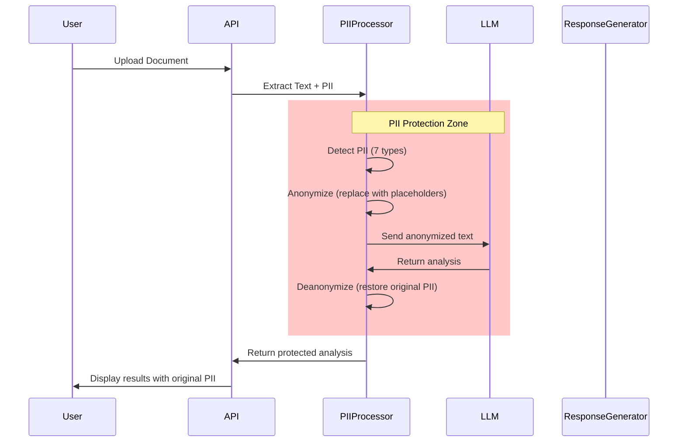

# Generative AI Document Processing System - Architecture Design

## Executive Summary

This document outlines the architecture for a scalable, secure, and privacy-focused Generative AI system designed to process, understand, summarize, and enable interactive interaction with complex legal and healthcare documents. The system leverages Google Gemini API, advanced OCR capabilities, and modern backend technologies to provide accurate, context-aware document analysis.

---

## 1. High-Level Architecture

```
┌─────────────────────────────────────────────────────────────────────────┐
│                         CLIENT & PRESENTATION LAYER                      │
├─────────────────────────────────────────────────────────────────────────┤
│  ┌─────────────────────┐    ┌─────────────────────┐                     │
│  │   Streamlit UI      │    │   API Gateway       │                     │
│  │   (Web Interface)   │    │   (REST Endpoints)  │                     │
│  └─────────────────────┘    └─────────────────────┘                     │
│         │                           │                                   │
│         └───────────────────────────┼───────────────────────────────────┘
│                                     │                                   │
└─────────────────────────────────────┼───────────────────────────────────┘
                                      │
┌─────────────────────────────────────▼───────────────────────────────────┐
│                         APPLICATION LAYER                               │
├─────────────────────────────────────────────────────────────────────────┤
│  ┌─────────────────────────────────────────────────────────────────┐   │
│  │                    API Backend (FastAPI/Flask)                   │   │
│  ├─────────────────────────────────────────────────────────────────┤   │
│  │  • Authentication & Authorization    • Rate Limiting            │   │
│  │  • Request Validation               • Response Formatting       │   │
│  └─────────────────────────────────────────────────────────────────┘   │
│         │                           │                                  │
│         ▼                           ▼                                  │
│  ┌──────────────┐           ┌─────────────────┐                       │
│  │ Job Queue    │           │  Task Scheduler │                       │
│  │ (Celery/RQ)  │           │  (APScheduler)  │                       │
│  └──────────────┘           └─────────────────┘                       │
└─────────────────────────────────────┬───────────────────────────────────┘
                                      │
┌─────────────────────────────────────▼───────────────────────────────────┐
│                      DOCUMENT PROCESSING LAYER                          │
├─────────────────────────────────────────────────────────────────────────┤
│                                                                         │
│  ┌─────────────────┐    ┌─────────────────┐    ┌─────────────────┐     │
│  │ Upload Handler  │───▶│  OCR Layer      │───▶│ Text Normalizer │     │
│  │ (Multi-format)  │    │ (Cloud Vision)  │    │                 │     │
│  └─────────────────┘    └─────────────────┘    └─────────────────┘     │
│         │                       │                       │               │
│         │                       │                       │               │
│         ▼                       ▼                       ▼               │
│  ┌─────────────────────────────────────────────────────────────┐       │
│  │              PII Protection Pipeline                          │       │
│  │  ┌─────────────┐    ┌─────────────────┐    ┌─────────────┐  │       │
│  │  │ PII Detector │───▶│ Anonymizer      │───▶│ Deanonymizer│  │       │
│  │  │ (Regex/ML)   │    │ (Placeholders)  │    │ (Restore)   │  │       │
│  │  └─────────────┘    └─────────────────┘    └─────────────┘  │       │
│  └─────────────────────────────────────────────────────────────┘       │
│                                                                         │
└─────────────────────────────────────┬───────────────────────────────────┘
                                      │
┌─────────────────────────────────────▼───────────────────────────────────┐
│                         AI PROCESSING LAYER                             │
├─────────────────────────────────────────────────────────────────────────┤
│                                                                         │
│  ┌─────────────────────────────────────────────────────────────────┐   │
│  │                   LLM Engine (Google Gemini)                     │   │
│  ├─────────────────────────────────────────────────────────────────┤   │
│  │  • Summarization       • Jargon Simplification                   │   │
│  │  • Risk Detection      • Question Answering                      │   │
│  │  • Translation         • Clause Analysis                        │   │
│  └─────────────────────────────────────────────────────────────────┘   │
│         │                                                               │
│         ▼                                                               │
│  ┌─────────────────────────────────────────────────────────────────┐   │
│  │              Vector Store & RAG Pipeline                          │   │
│  │  ┌─────────────┐    ┌─────────────────┐    ┌─────────────────┐  │   │
│  │  │ Embeddings  │───▶│ FAISS/Pinecone  │───▶│ CrossEncoder    │  │   │
│  │  │ (Sentence   │    │ Vector Database │    │ Reranking       │  │   │
│  │  │  Transformers)│    │                 │    │                 │  │   │
│  │  └─────────────┘    └─────────────────┘    └─────────────────┘  │   │
│  └─────────────────────────────────────────────────────────────────┘   │
│                                                                         │
└─────────────────────────────────────┬───────────────────────────────────┘
                                      │
┌─────────────────────────────────────▼───────────────────────────────────┐
│                          DATA & STORAGE LAYER                           │
├─────────────────────────────────────────────────────────────────────────┤
│                                                                         │
│  ┌─────────────────┐    ┌─────────────────┐    ┌─────────────────┐     │
│  │ Primary DB      │    │ Vector Store    │    │ File Storage    │     │
│  │ (PostgreSQL/    │    │ (FAISS/         │    │ (S3/Local)      │     │
│  │  MySQL)         │    │  Pinecone)      │    │                 │     │
│  └─────────────────┘    └─────────────────┘    └─────────────────┘     │
│                                                                         │
│  ┌─────────────────┐    ┌─────────────────┐                            │
│  │ Cache           │    │ Audit Logs      │                            │
│  │ (Redis)         │    │ (ELK Stack)     │                            │
│  └─────────────────┘    └─────────────────┘                            │
│                                                                         │
└─────────────────────────────────────────────────────────────────────────┘
```

---

## 2. Security & Privacy Architecture

### 2.1 Security Layers

```
┌─────────────────────────────────────────────────────────────┐
│                    SECURITY ARCHITECTURE                     │
├─────────────────────────────────────────────────────────────┤
│                                                             │
│  ┌─────────────────────────────────────────────────────┐    │
│  │  Layer 1: Network Security                          │    │
│  │  • TLS 1.3 for all communications                   │    │
│  │  • WAF protection                                   │    │
│  │  • DDoS mitigation                                  │    │
│  └─────────────────────────────────────────────────────┘    │
│                                                             │
│  ┌─────────────────────────────────────────────────────┐    │
│  │  Layer 2: Application Security                      │    │
│  │  • JWT authentication                               │    │
│  │  • Role-based access control (RBAC)                 │    │
│  │  • API rate limiting                                │    │
│  │  • Input validation & sanitization                  │    │
│  └─────────────────────────────────────────────────────┘    │
│                                                             │
│  ┌─────────────────────────────────────────────────────┐    │
│  │  Layer 3: Data Security                             │    │
│  │  • AES-256 encryption at rest                       │    │
│  │  • PII anonymization before AI processing           │    │
│  │  • Secure key management (Vault/AWS KMS)            │    │
│  │  • Data residency compliance                        │    │
│  └─────────────────────────────────────────────────────┘    │
│                                                             │
│  ┌─────────────────────────────────────────────────────┐    │
│  │  Layer 4: AI Safety                                 │    │
│  │  • PII never sent to external AI (anonymized)       │    │
│  │  • Hallucination detection                          │    │
│  │  • Output filtering                                 │    │
│  │  • Human-in-the-loop for critical decisions         │    │
│  └─────────────────────────────────────────────────────┘    │
│                                                             │
└─────────────────────────────────────────────────────────────┘
```

### 2.2 PII Processing Flow



---

## 3. Implementation Roadmap

### Phase 1: Core Infrastructure 
- [ ] Set up project structure and CI/CD pipeline
- [ ] Implement document upload and OCR pipeline
- [ ] Build basic PII detection and anonymization
- [ ] Create initial Streamlit UI
- [ ] Set up database schema

### Phase 2: AI Integration
- [ ] Integrate Google Gemini API
- [ ] Implement document summarization
- [ ] Build Q&A interface with RAG
- [ ] Add translation services
- [ ] Implement risk detection

### Phase 3: Security & Compliance
- [ ] Complete PII protection pipeline
- [ ] Implement authentication and RBAC
- [ ] Add audit logging
- [ ] Security testing and penetration testing
- [ ] Compliance review (GDPR, HIPAA)

### Phase 4: Scaling & Production
- [ ] Containerize with Docker
- [ ] Set up Kubernetes cluster
- [ ] Implement monitoring and alerting
- [ ] Load testing and optimization
- [ ] Production deployment

---

## 4. Conclusion

This architecture provides a comprehensive foundation for building a scalable, secure, and privacy-focused document AI processing system. The modular design allows for independent scaling of components, while the strong emphasis on PII protection ensures compliance with privacy regulations. The use of RAG and modern embedding techniques enables accurate, context-aware responses that can be traced back to source documents.

Key success factors:
- **Privacy-First Design**: PII protection at every stage
- **Scalable Architecture**: Microservices with Kubernetes orchestration
- **Cost Optimization**: Smart token management and caching
- **Quality Assurance**: Comprehensive testing and hallucination detection
- **User Experience**: Intuitive interface with multilingual support
