# AccessAI - System Design Document

## Executive Summary

AccessAI is a voice-first, multilingual healthcare access platform that converts complex medical reports into simple, regional-language audio guidance and connects users with government healthcare schemes.

**Problem:** A lot of rural patients cannot understand their medical reports due to medical jargon, language barriers, and limited access to healthcare professionals.

**Solution:** AI-powered platform that provides instant medical report interpretation through voice-based explanations in regional languages, optimized for low-bandwidth environments and low-literacy users.

**Key Innovation:** RAG-powered medical interpretation combined with government scheme matching, delivered through optimized voice interfaces specifically designed for rural India.

**Target Impact:**
- Reduce treatment delays caused by medical literacy gaps
- Increase awareness and utilization of government healthcare schemes
- Provide accessible healthcare guidance to underserved communities

---

## System Architecture

### High-Level Architecture

```
┌──────────────────────────────────────────────────────────────────────────────┐
│                          USER INTERFACE LAYER                                 │
├──────────────────────────────────────────────────────────────────────────────┤
│                                                                              │
│   • Progressive Web Application (React/Next.js)                              │                                          │
│   • Language Selection Interface                                             │
│   • Report Upload (Image/PDF/Camera)                                         │
│                                                                              │
└───────────────────────────────────────┬──────────────────────────────────────┘
                                        │ HTTPS
                                        ▼
┌──────────────────────────────────────────────────────────────────────────────┐
│                            API GATEWAY LAYER                                  │
├──────────────────────────────────────────────────────────────────────────────┤
│                                                                              │
│   Amazon API Gateway                                                         │
│   • Authentication & Rate Limiting                                           │
│   • Request Routing                                                          │
│   • Response Compression                                                     │
│                                                                              │
└───────────────────────────────────────┬──────────────────────────────────────┘
                                        │
                                        ▼
┌──────────────────────────────────────────────────────────────────────────────┐
│                    ORCHESTRATION & PII LAYER                                  │
├──────────────────────────────────────────────────────────────────────────────┤
│                                                                              │
│   AWS Lambda (Serverless Backend)                                            │
│   • PII Anonymization (Remove: name, phone, address, IDs)                    │
│   • Workflow Orchestration                                                   │
│   • Response Aggregation                                                     │
│                                                                              │
└───────────────────────────────────────┬──────────────────────────────────────┘
                                        │
                                        ▼
┌──────────────────────────────────────────────────────────────────────────────┐
│                        DOCUMENT PROCESSING LAYER                              │
├──────────────────────────────────────────────────────────────────────────────┤
│                                                                              │
│   Amazon Textract                                                            │
│   • OCR Text Extraction                                                      │
│   • Medical Entity Recognition                                               │
│   • Parameter Extraction (Hb, BP, glucose, etc.)                             │
│                                                                              │
└───────────────────────────────────────┬──────────────────────────────────────┘
                                        │
                                        ▼
┌──────────────────────────────────────────────────────────────────────────────┐
│                           AI PROCESSING LAYER                                 │
├──────────────────────────────────────────────────────────────────────────────┤
│                                                                              │
│   Amazon Bedrock (Claude 4.5 Haiku)                                          │
│   • Medical Interpretation                                                   │
│   • Jargon Simplification                                                    │
│   • Risk-Aware Guidance                                                      │
│                                                                              │
│   Retrieval-Augmented Generation (RAG)                                       │
│   • Amazon OpenSearch (Vector Database)                                      │
│   • Medical Knowledge Retrieval                                              │
│   • Government Scheme Matching                                               │
│                                                                              │
└───────────────────────────────────────┬──────────────────────────────────────┘
                                        │
                                        ▼
┌──────────────────────────────────────────────────────────────────────────────┐
│                        OUTPUT GENERATION LAYER                                │
├──────────────────────────────────────────────────────────────────────────────┤
│                                                                              │
│   Text Processing                                                            │
│   • Summary Generation                                                       │
│   • Regional Language Translation                                            │
│                                                                              │
│   Amazon Polly (Neural TTS)                                                  │
│   • Voice Synthesis (Hindi, Telugu, Tamil, Kannada, etc.)                    │
│   • Audio Compression (32kbps, <200KB)                                       │
│                                                                              │
└───────────────────────────────────────┬──────────────────────────────────────┘
                                        │
                                        ▼
┌──────────────────────────────────────────────────────────────────────────────┐
│                          STORAGE LAYER                                        │
├──────────────────────────────────────────────────────────────────────────────┤
│                                                                              │
│   Amazon S3: Document storage (24-hour auto-delete)                          │
│   ElastiCache (Redis): Audio caching (7 days)                                │
│   RDS PostgreSQL: Medical knowledge base, government schemes                 │
│                                                                              │
└──────────────────────────────────────────────────────────────────────────────┘
```

---

## Data Flow

### End-to-End Processing Pipeline

```
User Upload → OCR → Document Classification → 
Knowledge Retrieval → LLM Reasoning → Simplification → 
Translation → Text-to-Speech → Compressed Audio → User
```

### Detailed Flow with Components

```
┌─────────────┐   ┌──────────────┐   ┌───────────────┐   ┌──────────────┐
│ User Upload │ → │   Textract   │ → │ PII Remove &  │ → │   Bedrock    │
│ Image/PDF   │   │  (OCR Text)  │   │   Classify    │   │   (Claude)   │
└─────────────┘   └──────────────┘   └───────────────┘   └──────────────┘
                                                                  │
                                                                  ▼
┌─────────────┐   ┌──────────────┐   ┌───────────────┐   ┌──────────────┐
│    User     │ ← │    Polly     │ ← │  Translate to │ ← │  OpenSearch  │
│  Receives   │   │ (Audio Gen)  │   │ Hindi/Telugu  │   │  (RAG Query) │
└─────────────┘   └──────────────┘   └───────────────┘   └──────────────┘
```

## Technology Stack

### Core AWS Services

| Component | Technology | Purpose |
|-----------|-----------|---------|
| **OCR** | Amazon Textract | Extract text from medical reports (images/PDFs) |
| **AI Reasoning** | Amazon Bedrock (Claude 4.5 Haiku) | Medical interpretation and simplification |
| **Voice Output** | Amazon Polly (Neural TTS) | Regional language audio generation |
| **Knowledge Base** | Amazon OpenSearch | Vector database for RAG-based retrieval |
| **Speech Input** | Amazon Transcribe | Voice-to-text conversion (future) |
| **Backend** | AWS Lambda | Serverless orchestration and processing |
| **API Gateway** | Amazon API Gateway | Request routing and rate limiting |
| **Storage** | Amazon S3 | Temporary document storage (24h retention) |
| **Cache** | Amazon ElastiCache (Redis) | Audio file caching |
| **Database** | Amazon RDS (PostgreSQL) | Medical knowledge and government schemes |

---

## User Flow Diagram

```mermaid
%%{
  init: {
    "theme": "dark",
    "themeVariables": {
      "darkMode": true,
      "primaryColor": "#2196F3",
      "secondaryColor": "#FF9800",
      "tertiaryColor": "#9C27B0",
      "lineColor": "#E0E0E0",
      "textColor": "#FFFFFF",
      "mainBkg": "#1e1e2e",
      "nodeBkg": "#1e1e2e",
      "clusterBkg": "#121212",
      "clusterBorder": "#2196F3"
    },
    "flowchart": {
      "curve": "basis",
      "padding": 40,
      "nodeSpacing": 80,
      "rankSpacing": 120
    }
  }
}%%

flowchart TD
    %% Styling
    classDef inputStyle fill:#1a3a5c,stroke:#2196F3,stroke-width:2px,color:#ffffff
    classDef processStyle fill:#3d2914,stroke:#FF9800,stroke-width:2px,color:#ffffff
    classDef outputStyle fill:#1a2e3a,stroke:#9C27B0,stroke-width:2px,color:#ffffff
    
    %% Input Stage
    subgraph INPUT[" USER INPUT "]
        direction TB
        A1["Open Application"]:::inputStyle
        A2["Select Language<br/>Hindi | Telugu | Tamil"]:::inputStyle
        A3["Upload Medical Report<br/>Image | PDF | Camera Scan"]:::inputStyle
        
        A1 --> A2 --> A3
    end
    
    %% Processing Stage
    subgraph PROCESS[" AI PROCESSING "]
        direction TB
        B1["Text Extraction<br/>Amazon Textract"]:::processStyle
        B2["PII Anonymization<br/>Remove Personal Information"]:::processStyle
        B3["Medical Interpretation<br/>Amazon Bedrock Claude 4.5"]:::processStyle
        B4["Knowledge Retrieval<br/>RAG - OpenSearch Vector DB"]:::processStyle
        B5["Generate Summary<br/>Simplified Explanation"]:::processStyle
        
        B1 --> B2 --> B3 --> B4 --> B5
    end
    
    %% Output Stage
    subgraph OUTPUT[" USER OUTPUT "]
        direction TB
        C1["Audio Explanation<br/>Amazon Polly TTS"]:::outputStyle
        C2["Text Summary<br/>Health Status & Findings"]:::outputStyle
        C3["Government Scheme Match<br/>Ayushman Bharat | State Programs"]:::outputStyle
        
        C1 --> C2 --> C3
    end
    
    %% Flow Connections
    A3 -.->|"Document Uploaded"| B1
    B5 -.->|"Processing Complete"| C1
    
    %% Subgraph Styling
    style INPUT fill:#0d1b2a,stroke:#2196F3,stroke-width:2px
    style PROCESS fill:#1a0f00,stroke:#FF9800,stroke-width:2px
    style OUTPUT fill:#0f1a1a,stroke:#9C27B0,stroke-width:2px
```


