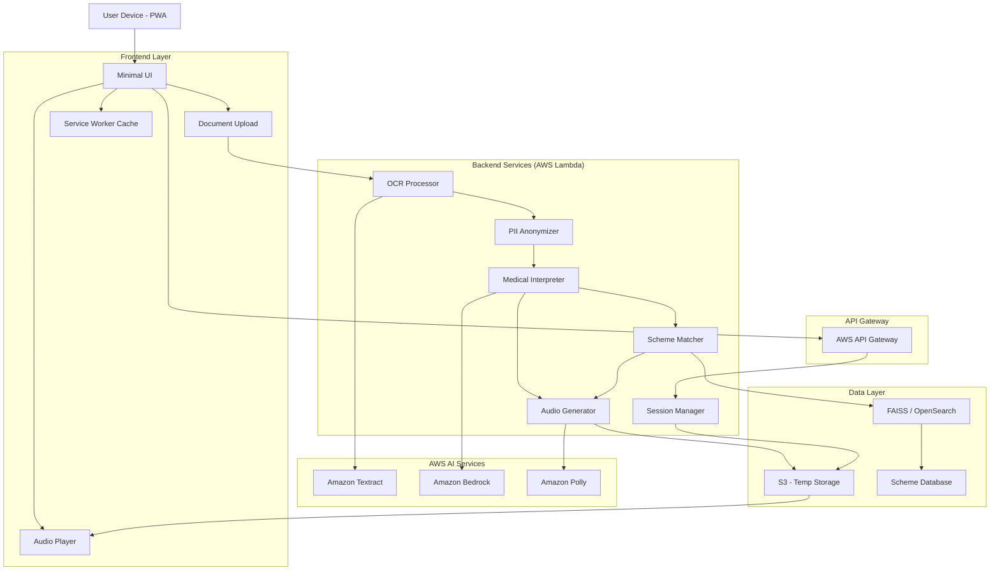

# Design Document: AccessAI

## Overview

AccessAI is a voice-output-first healthcare information system designed for underserved communities in India. The system enables users to upload medical documents and receive simple, regional-language audio explanations of their medical information, along with matched government healthcare schemes.

AccessAI is intentionally **non-diagnostic** and functions as an information and navigation layer, not a medical decision-making system.

---

## Core Architecture Principles

1. **Voice-Output First**  
   All primary outputs are delivered as audio to reduce literacy barriers. User inputs are document uploads or simple text interactions only.

2. **Privacy by Design**  
   Personally identifiable information (PII) is anonymized before any AI processing. All data is session-scoped, ephemeral, and encrypted in transit and at rest.

3. **Low-Bandwidth Optimization**  
   Audio is compressed (≤32kbps), interfaces are minimal, and Progressive Web App (PWA) caching is used to support unreliable connectivity.

4. **Non-Diagnostic by Construction**  
   System prompts, output filters, and correctness checks prevent diagnosis, prescriptions, or treatment advice.

5. **Multilingual Accessibility**  
   All explanations, scheme descriptions, and system messages are delivered in supported regional languages.

---

## Technology Stack (Reference Design)

- **Frontend**: React / Next.js PWA with UI  
- **Backend**: FastAPI on AWS Lambda (serverless)  
- **OCR**: Amazon Textract  
- **Text-to-Speech**: Amazon Polly (Neural voices)  
- **LLM**: Amazon Bedrock (Claude 4 Sonnet)  
- **Vector Search**: FAISS (MVP) / Amazon OpenSearch (production)  
- **Storage**: Amazon S3 with lifecycle-based deletion  
- **Caching**: CloudFront CDN, browser service worker cache  

---

## Architecture

### System Components

## Data Flow

### Medical Document Processing Flow

1. User uploads a medical report (image or PDF).
2. Amazon Textract extracts raw text and confidence scores.
3. PII is anonymized before any AI processing.
4. The LLM generates plain-language explanations and extracts structured entities.
5. Extracted entities are used for government scheme matching (RAG).
6. Explanations and scheme details are converted to compressed audio.
7. Audio is streamed to the user and session data is deleted on expiry.

---

## Explicit Scope Boundaries

### In Scope
- Medical report explanation
- Plain-language summaries
- Government scheme discovery
- Voice-based output delivery

### Out of Scope (By Design)
- Diagnosis or disease prediction
- Medication or treatment recommendations
- Voice-based user input
- Long-term medical record storage
- Telemedicine or clinician interaction

---

## Trust Boundaries and PII Handling

- Raw user documents exist only before anonymization.
- The LLM never receives PII.
- Vector embeddings contain anonymized content only.
- Logs store metadata only (no medical content, no PII).
- All session data is deleted within a fixed TTL.

---

## Correctness Properties (Selected)

The following properties must hold for all valid executions:

1. **Language Consistency**  
   All audio and text outputs match the user’s selected language.

2. **PII Safety**  
   No PII appears in LLM inputs, vector embeddings, logs, or outputs.

3. **Non-Diagnostic Output**  
   Outputs never contain diagnoses, prescriptions, or treatment advice.

4. **Low-Bandwidth Compliance**  
   Audio outputs use compressed formats ≤32kbps.

5. **Session Ephemerality**  
   All session data is deleted on expiry without manual intervention.

---

## Error Handling Strategy

### Principles
- Fail safely, not silently
- Prefer warnings over blocking
- Always explain errors via audio

### Examples
- Low OCR confidence → audio warning and continue
- Network delay → audio status updates
- AI service timeout → retry or graceful exit

---

## Testing Strategy

### Levels
- Unit tests for core services
- Integration tests with mocked cloud services
- Property-based tests for invariants (language, PII, non-diagnostic)
- End-to-end tests for critical user journeys

### Coverage Goals
- ≥80% unit test coverage
- All correctness properties validated
- Low-bandwidth scenarios simulated

---

## Deployment and Scalability

- Fully serverless architecture
- Automatic scaling via AWS Lambda
- CDN caching for static assets
- Lifecycle policies for automatic data cleanup

---

## Known Limitations

- OCR accuracy depends on document quality
- Explanations are informational, not authoritative
- Scheme eligibility matching is advisory, not guaranteed
- No real-world field validation at ideation stage

---

## Future Enhancements

- Additional regional languages
- Offline audio access
- SMS-based summaries
- Community health worker dashboards
- Fine-tuned models for Indian medical context
